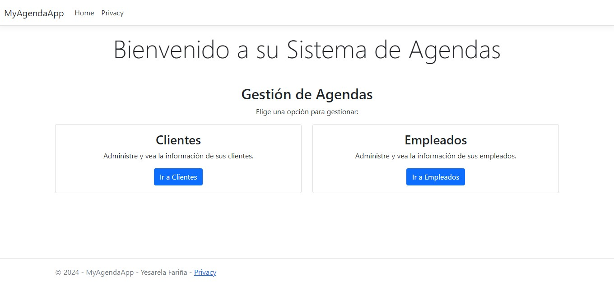
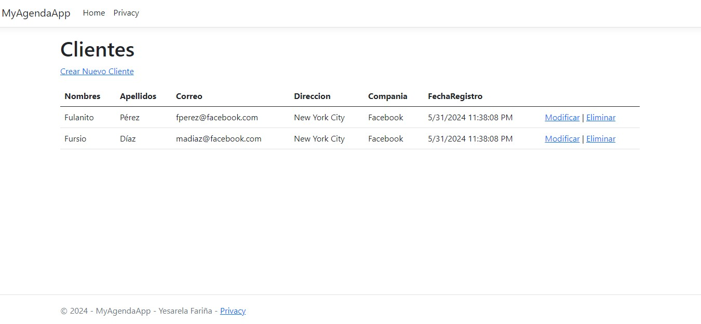
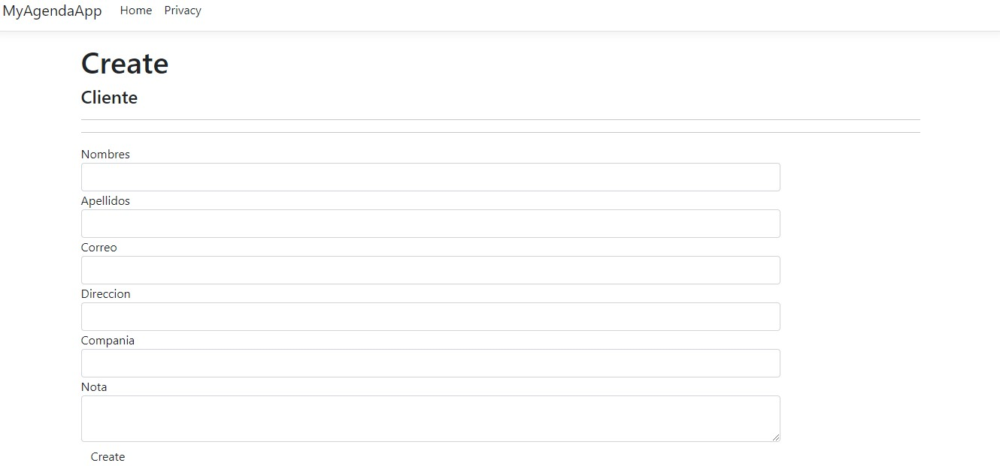
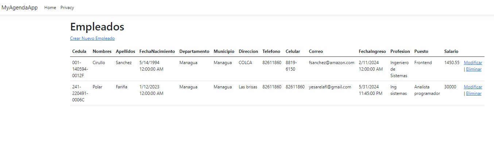
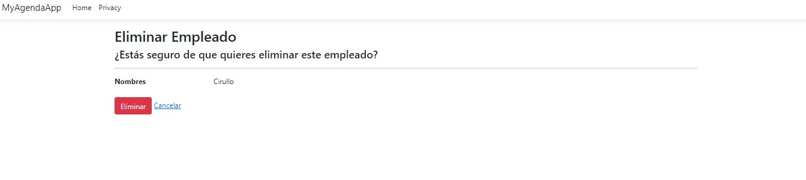
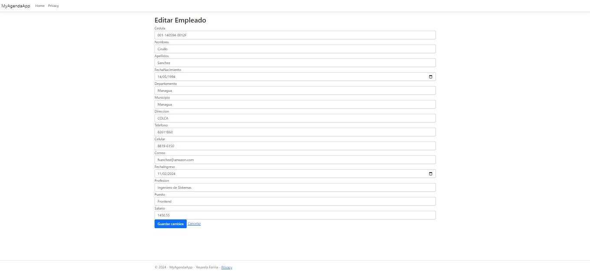

# Examen de Ingenieria de Software III

Este trabajo es de Yesarela Fariña, no me lo clonen :), hagan sus propias tareas, _*muchas gracias <3*_.

## Requerimientos

- .NET SDK 8
- Microsoft Sql Server Community

## Pasos a Seguir

### Base de datos

Se deberá ejecutar el siguiente scrip en nuestro gestor de SQL Server.

#### Script MyAgendaApp

El siguiente scrip deberá ser ejecutado con una conexión establecida en Master, en caso tal de crear previamente la BD entonces se deberá omitir las instrucciones de `drop database`, `create database` y `use database` respectivamente:

```
drop database db_agenda -- Ejecutar solo si ya existe previamente
go
create database db_agenda
go
use db_agenda
go

Create table Clientes(
idcliente int primary key identity(1,1),
nombres varchar(100) not null,
apellidos varchar(100) not null,
correo varchar(50),
direccion varchar(200) not null,
compania varchar(40),
nota varchar(max),
fecharegistro datetime
);

create table Empleados(
idempleado int primary key identity(1,1),
cedula varchar(20) not null,
nombres varchar(100) not null,
apellidos varchar(100) not null,
fechanacimiento date not null,
departamento varchar(40),
municipio varchar(40),
direccion varchar(200) not null,
telefono varchar(15),
celular varchar(15),
correo varchar(50),
fechaingreso datetime,
Profesion varchar(40),
puesto varchar(40),
salario double precision
);
go
/*Procedimientos Almacenados*/

-- Clientes

-- Crear
CREATE OR ALTER PROCEDURE sp_insert_Clientes
    @nombres VARCHAR(100),
    @apellidos VARCHAR(100),
    @correo VARCHAR(50),
    @direccion VARCHAR(200),
    @compania VARCHAR(40),
    @nota VARCHAR(MAX)
AS
BEGIN
    SET NOCOUNT ON;
    BEGIN TRY
        BEGIN TRANSACTION;
        
        INSERT INTO Clientes (nombres, apellidos, correo, direccion, compania, nota, fecharegistro)
        VALUES (@nombres, @apellidos, @correo, @direccion, @compania, @nota, getdate());
        
        COMMIT TRANSACTION;
    END TRY
    BEGIN CATCH
        ROLLBACK TRANSACTION;
        THROW;
    END CATCH
END
GO

-- Actualizar
CREATE OR ALTER PROCEDURE sp_update_Clientes
    @idcliente INT,
    @nombres VARCHAR(100),
    @apellidos VARCHAR(100),
    @correo VARCHAR(50),
    @direccion VARCHAR(200),
    @compania VARCHAR(40),
    @nota VARCHAR(MAX)
AS
BEGIN
    SET NOCOUNT ON;
    BEGIN TRY
        BEGIN TRANSACTION;

        UPDATE Clientes
        SET nombres = @nombres, 
            apellidos = @apellidos, 
            correo = @correo, 
            direccion = @direccion, 
            compania = @compania, 
            nota = @nota
        WHERE idcliente = @idcliente;

        COMMIT TRANSACTION;
    END TRY
    BEGIN CATCH
        ROLLBACK TRANSACTION;
        THROW;
    END CATCH
END
GO 

-- Eliminar
CREATE OR ALTER PROCEDURE sp_delete_Clientes
    @idcliente INT
AS
BEGIN
    SET NOCOUNT ON;
    BEGIN TRY
        BEGIN TRANSACTION;

        DELETE FROM Clientes
        WHERE idcliente = @idcliente;

        COMMIT TRANSACTION;
    END TRY
    BEGIN CATCH
        ROLLBACK TRANSACTION;
        THROW;
    END CATCH
END
GO

-- Leer
CREATE OR ALTER PROCEDURE sp_select_Clientes
    @idcliente INT = null
AS
BEGIN
    SET NOCOUNT ON;
	if (@idcliente is null)
		SELECT * FROM Clientes;
	else
		SELECT * FROM Clientes WHERE idcliente = @idcliente;
END
GO

-- Empleados

-- Crear
CREATE OR ALTER PROCEDURE sp_insert_Empleados
    @cedula VARCHAR(20),
    @nombres VARCHAR(100),
    @apellidos VARCHAR(100),
    @fechanacimiento DATE,
    @departamento VARCHAR(40),
    @municipio VARCHAR(40),
    @direccion VARCHAR(200),
    @telefono VARCHAR(15),
    @celular VARCHAR(15),
    @correo VARCHAR(50),
	@fechaingreso datetime,
    @profesion VARCHAR(40),
    @puesto VARCHAR(40),
    @salario double precision
AS
BEGIN
    SET NOCOUNT ON;
    BEGIN TRY
        BEGIN TRANSACTION;

        INSERT INTO Empleados (cedula, nombres, apellidos, fechanacimiento, departamento, municipio, direccion, telefono, celular, correo, fechaingreso, Profesion, puesto, salario)
        VALUES (@cedula, @nombres, @apellidos, @fechanacimiento, @departamento, @municipio, @direccion, @telefono, @celular, @correo, @fechaingreso, @profesion, @puesto, @salario);

        COMMIT TRANSACTION;
    END TRY
    BEGIN CATCH
        ROLLBACK TRANSACTION;
        THROW;
    END CATCH
END
GO

-- Actualizar
CREATE OR ALTER PROCEDURE sp_update_Empleados
    @idempleado INT,
    @cedula VARCHAR(20),
    @nombres VARCHAR(100),
    @apellidos VARCHAR(100),
    @fechanacimiento DATE,
    @departamento VARCHAR(40),
    @municipio VARCHAR(40),
    @direccion VARCHAR(200),
    @telefono VARCHAR(15),
    @celular VARCHAR(15),
    @correo VARCHAR(50),
    @profesion VARCHAR(40),
    @puesto VARCHAR(40),
    @salario double precision
AS
BEGIN
    SET NOCOUNT ON;
    BEGIN TRY
        BEGIN TRANSACTION;

        UPDATE Empleados
        SET cedula = @cedula, 
            nombres = @nombres, 
            apellidos = @apellidos, 
            fechanacimiento = @fechanacimiento, 
            departamento = @departamento, 
            municipio = @municipio, 
            direccion = @direccion, 
            telefono = @telefono, 
            celular = @celular, 
            correo = @correo, 
            Profesion = @profesion, 
            puesto = @puesto, 
            salario = @salario
        WHERE idempleado = @idempleado;

        COMMIT TRANSACTION;
    END TRY
    BEGIN CATCH
        ROLLBACK TRANSACTION;
        THROW;
    END CATCH
END
GO

-- Eliminar 
CREATE OR ALTER PROCEDURE sp_delete_Empleados
    @idempleado INT
AS
BEGIN
    SET NOCOUNT ON;
    BEGIN TRY
        BEGIN TRANSACTION;

        DELETE FROM Empleados
        WHERE idempleado = @idempleado;

        COMMIT TRANSACTION;
    END TRY
    BEGIN CATCH
        ROLLBACK TRANSACTION;
        THROW;
    END CATCH
END
GO

-- Leer
CREATE OR ALTER PROCEDURE sp_select_Empleados
    @idempleado INT = null
AS
BEGIN
    SET NOCOUNT ON;
	if (@idempleado is null)
		SELECT * FROM Empleados;
	else
		SELECT * FROM Empleados WHERE idempleado = @idempleado;
END
GO

-- Data inicial

-- Clientess

exec sp_insert_Clientes 'Fulanito', 'Pérez', 'fperez@facebook.com', 'New York City', 'Facebook', 'Trabajador de Meta/Facebook en VR.';
exec sp_insert_Clientes 'Mengano', 'Díaz', 'madiaz@facebook.com', 'New York City', 'Facebook', 'Trabajador de Meta/Facebook en VR.';

exec sp_select_Clientes;

-- Empleados

exec sp_insert_Empleados '001-140591-0021A', 'Sutanito', 'Vásquez', '1991-05-14', 'Managua', 'Managua', 'COLCA', '', '8852-6920', 'svasquez@amazon.com', '2024-05-21 15:30:26', 'Ingeniero de Sistemas', 'Backend', 1500.10;
exec sp_insert_Empleados '001-140594-0012F', 'Firulo', 'Sanchez', '1994-05-14', 'Managua', 'Managua', 'COLCA', '', '8819-6150', 'fsanchez@amazon.com', '2024-02-11 16:22:14', 'Ingeniero de Sistemas', 'Frontend', 1450.55;

exec sp_select_Empleados;
```

### Proyecto

#### Modificar la cadena de conexión

Deberemos editar nuestro `appsettings.json` con los valores según nuestro servidor configurado de Sql Server, se verá algo así el archivo:

```
{
  "ConnectionStrings": {
    "DefaultConnection": "Server=DESKTOP-3C89K7L\\SQLEXPRESS;Database=db_agenda;Trusted_Connection=True;TrustServerCertificate=True;MultipleActiveResultSets=true"
  },
  "Logging": {
    "LogLevel": {
      "Default": "Information",
      "Microsoft.AspNetCore": "Warning"
    }
  },
  "AllowedHosts": "*"
}
```

#### Restaurar los paquetes nuggets

    dotnet restore

#### Construir el proyecto

    dotnet build

#### Iniciar el proyecto

    dotnet run    

## MyAgendaApp Imagenes

### Home



### Clientes



### Crear Cliente Nuevo



###  Empleados



### Eliminar Empleados



### Editar Empleados

